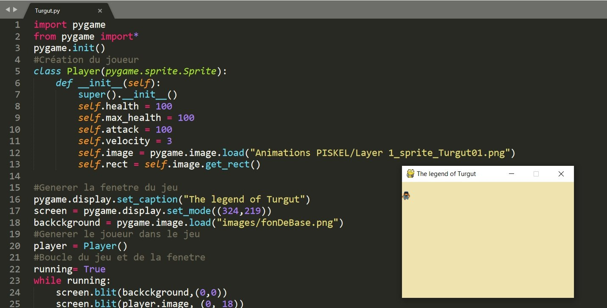

# ⚔️ The Legend Of Turgut ⚔️

## Un jeu d’aventure rétro en pixel-art

### 🎮 Introduction

**Bienvenue dans l’univers de _The Legend of Turgut_**, un jeu d’aventure en pixel-art fait maison !

Passionné par la programmation, j’ai voulu créer un projet ludique qui me pousse à coder régulièrement. Après avoir testé différents moteurs (Phaser.js, Pygame, Unity), j’ai finalement choisi de revenir à une version en **Python**, simple, souple, et idéale pour ce type de jeu.

Mais ce projet n’est pas né tout seul : **mes enfants ont été mes coéquipiers** tout au long du développement. Ils ont dessiné les personnages, imaginé les histoires, et participé à la création des animations. C’est devenu une belle aventure familiale, entre créativité, apprentissage du code et fous rires !

---

### 🧙‍♂️ Qui est Turgut ?

**Turgut**, c’est notre héros, un jeune nomade venu d’Anatolie, à l’époque des grandes migrations turques. Il explore un monde inspiré de l’histoire et des légendes de Turquie, parfait pour un RPG riche en quêtes et en mystères.

J’ai choisi un style **pixel-art rétro**, à la fois pour le clin d’œil aux jeux de mon enfance (coucou Zelda !) et pour me concentrer sur l’essentiel : le gameplay et la narration.

> 🎨 Le personnage a été imaginé avec **PISKEL**, en hommage à Link, et adapté pour un gameplay moderne, plus interactif.

---

### 👨‍👩‍👧‍👦 Une aventure familiale

Ce jeu, c’est aussi une **histoire de famille**. Entre deux séances de papercraft et de dessins, on a réfléchi ensemble à l’univers, aux personnages, aux dialogues… et même au nom de Turgut !

C’est aussi une super porte d’entrée pour initier les enfants à la **programmation** de manière concrète et amusante.

---

### 🧑‍💻 D'où vient ce projet ?

Chaque mise à jour est l’occasion de peaufiner le code, d’ajouter des mécaniques (gestion de l’inventaire, PNJ, quêtes secondaires…) et de faire tester les nouveautés par mes enfants.

---

### 🧩 Créativité à tous les niveaux

Merci d’avoir pris le temps de découvrir notre projet.  
N’hésitez pas à tester le jeu, à nous faire des retours… ou même à rejoindre l’aventure !

---
